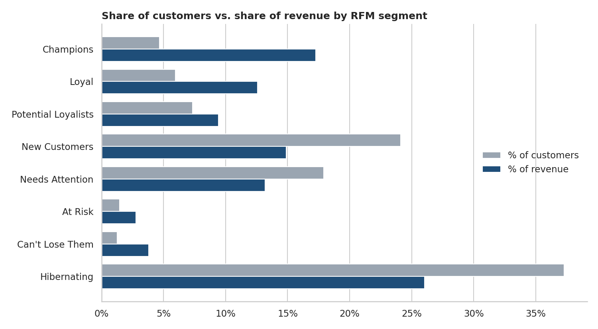
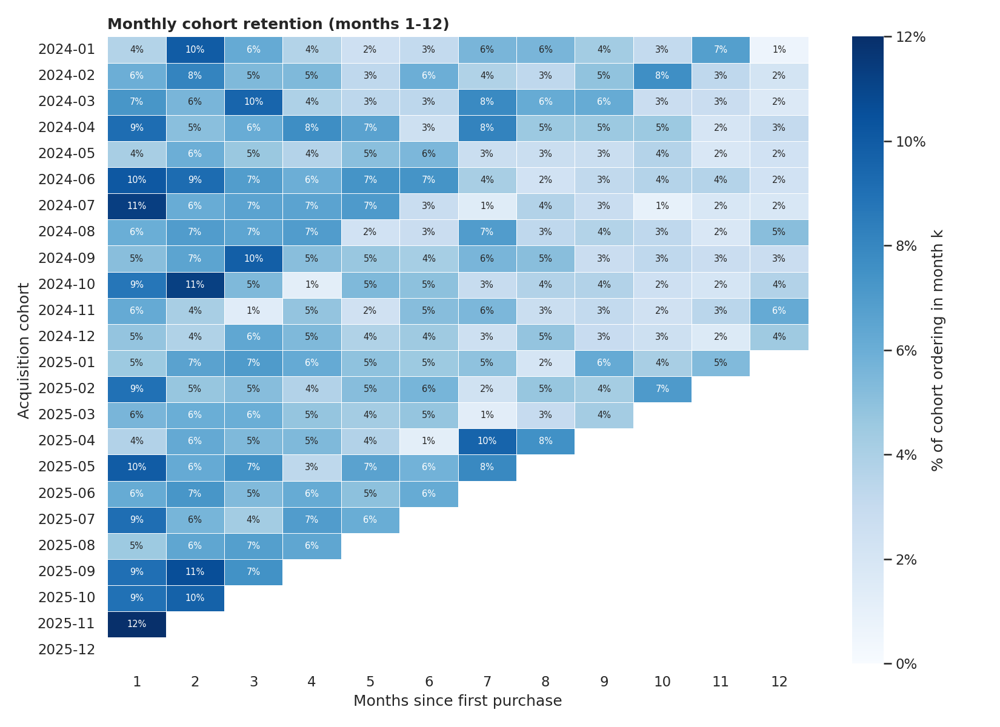
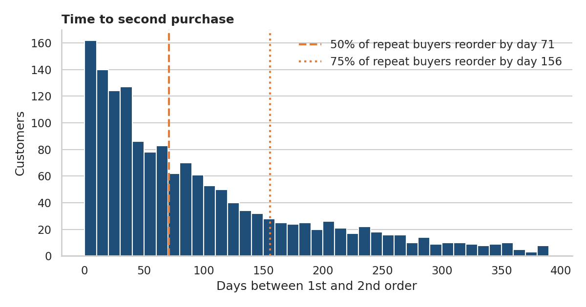
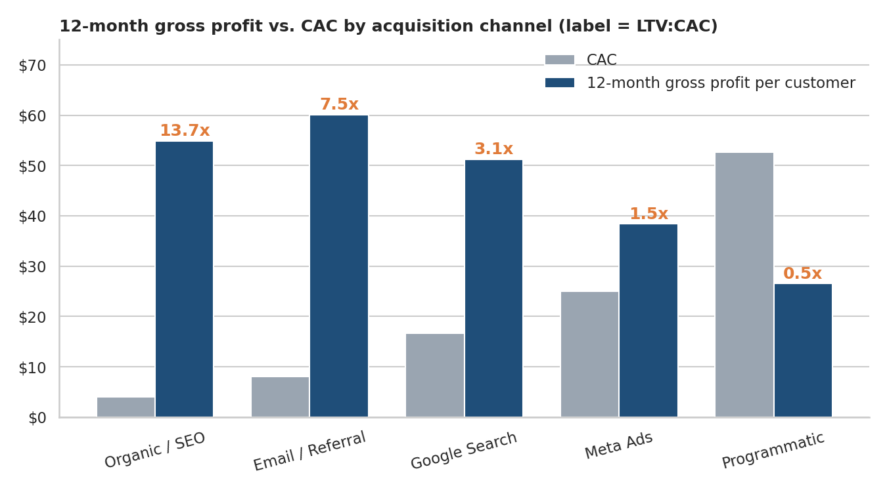

# Customer Segmentation & Retention Marketing: RFM, Cohorts and CLV by Channel

**Personal / hands-on digital marketing + data analytics project**

> **Note:** This is a personal practice project. The data is **simulated**
> (reproducible with `data/generate_data.py`) to mimic a home & lifestyle
> e-commerce store. It does not come from a live client account. The
> methodology, however, is the same I would apply to a real transactions export.

---

## Context

My previous projects focused on **acquisition**:
[Google Ads optimization](https://github.com/TomasVargas1911/google-ads-optimization-case-study) and
[multi-platform paid media budgeting](https://github.com/TomasVargas1911/paid-media-budget-optimization).
This project answers the next question a marketing team faces:

> Once we pay to acquire a customer, **who is worth keeping, who is slipping away,
> and which acquisition channels actually bring customers that come back?**

It closes the loop between acquisition and retention: CAC per channel comes from
my paid-media project, and the LTV results feed back into where to test budget.

## Objectives

- Clean raw transactional data and build customer-level features.
- Segment customers with **RFM** and validate the segments with **K-Means**.
- Measure revenue concentration and **cohort retention**.
- Find the timing of the **second purchase** to design lifecycle flows.
- Calculate **12-month CLV and LTV:CAC by acquisition channel**.
- Size a **win-back campaign** and export **CRM-ready audiences**.

## Tools used

Python (pandas, NumPy, scikit-learn, matplotlib, seaborn), Jupyter Notebook.

## Dataset (simulated)

| Table | Rows | Fields |
|---|---|---|
| `customers.csv` | 6,000 | `customer_id`, `acquisition_channel` |
| `orders.csv` | 9,636 | `order_id`, `customer_id`, `order_date`, `order_value`, `items`, `status` |

24 months (Jan 2024 to Dec 2025), five acquisition channels, Q4 seasonality, and
intentionally messy data (duplicates, cancelled and refunded orders, missing channels)
to make the cleaning step realistic. The notebook only depends on this two-table
schema, so a real dataset (for example UCI *Online Retail II*) can be used by mapping its columns.

## Process

1. **Data cleaning:** removed 38 duplicate rows, 244 cancelled and 129 refunded orders; imputed 60 missing channels as `Unknown`.
2. **RFM segmentation:** quintile scores for Recency and Monetary; fixed bins for Frequency (about 72% of customers have one order, so quintiles would be meaningless). Eight segments assigned by explicit rules.
3. **Validation:** K-Means on log-scaled, standardised R/F/M, silhouette analysis to compare against the rule-based segments.
4. **Revenue concentration:** Pareto curve.
5. **Cohort retention:** monthly acquisition cohorts, with unobserved periods masked (not shown as 0%).
6. **Time to second purchase:** distribution and conversion within 14 to 180 days.
7. **CLV and LTV:CAC by channel:** observed 12-month revenue for customers acquired in 2024, gross margin 45%, CAC per channel.
8. **Win-back scenario:** audience x reactivation rate x order value x margin after discount, minus cost, with a holdout design for measuring incrementality.

## Key results

| Metric | Result |
|---|---|
| Revenue / Orders / Customers | $570,837 / 9,225 / 5,837 |
| AOV | $61.88 |
| Repeat purchase rate | 27.9% |
| Revenue from repeat customers | **55.0%** |
| Top 20% of customers | 48.2% of revenue |
| Champions + Loyal | 10.6% of customers, ~30% of revenue |
| Median time to 2nd order | 71 days (only 7.3% reorder within 30 days) |
| Customers with 6+ months of history who never reordered | ~68% |

**12-month LTV:CAC by acquisition channel** (gross profit basis):

| Channel | 12-month repeat rate | 12-month revenue / customer | CAC | LTV:CAC |
|---|---|---|---|---|
| Organic / SEO* | 36.7% | $121.95 | $4.00 | 13.7x |
| Email / Referral* | 47.0% | $133.54 | $8.00 | 7.5x |
| Google Search | 35.2% | $113.87 | $16.67 | 3.1x |
| Meta Ads | 26.9% | $85.28 | $25.00 | 1.5x |
| Programmatic | 11.6% | $58.91 | $52.59 | 0.5x |

\*CAC for Organic and Email/Referral is an assumed allocation. Paid-channel CAC is taken from the simulated CPA in
[`paid-media-budget-optimization`](https://github.com/TomasVargas1911/paid-media-budget-optimization).

**Win-back scenario** (illustrative assumptions, 15% discount, $0.30 per contact): the best opportunity is
**Needs Attention** (1,046 customers, ROI 3.9x) *before* they become Hibernating, where the same
outreach does not pay back (0.8x). Total scenario: ~3,400 customers contacted, ~$2.1k net profit (2.1x on campaign cost).

## Visualizations

**Customers vs. revenue by segment**



**Cohort retention**



**Time to second purchase**



**12-month gross profit vs. CAC by channel**



## Recommendations

| Segment | Goal | Tactic |
|---|---|---|
| Champions / Loyal | Protect and grow | Early access, loyalty tier, referral programme (no discounts) |
| Potential Loyalists / New | Secure the 2nd order | Post-purchase flow timed before the median 71-day reorder point; cross-sell |
| Needs Attention | Re-engage before they cool | Personalised reminder, social proof, light incentive |
| At Risk / Can't Lose Them | Win back high-value customers | Personal outreach, stronger offer, feedback survey, Customer Match |
| Hibernating | Stop spending | Email-only sunset sequence; exclude from paid audiences |

**For acquisition:** run budget *tests* toward channels with the best LTV:CAC, and build lookalike audiences from Champions rather than from all purchasers.
Programmatic is an awareness channel, so its weak last-touch LTV:CAC should trigger a lift test, not an automatic cut.

## Key learnings and skills demonstrated

- Turning raw transactions into customer-level features with pandas.
- Customer segmentation (RFM) and validation with unsupervised learning.
- Cohort and retention analysis; reading the data carefully (masking unobserved periods, handling skewed frequency).
- Connecting acquisition cost to customer lifetime value to inform budget decisions.
- Translating analysis into an actionable CRM plan, with explicit assumptions and an incrementality (holdout) design.

## Limitations and next steps

- Simulated data: patterns are plausible, but the numbers are not benchmarks.
- 12-month CLV is **observed**, not predicted. Next step: BG/NBD + Gamma-Gamma to project CLV for recent cohorts.
- Reactivation rates, margin and some CACs are assumptions to be replaced with real test results.
- Re-run the pipeline on a real public dataset (UCI Online Retail II).

## How to run

```bash
git clone https://github.com/TomasVargas1911/retention-marketing-rfm-clv.git
cd retention-marketing-rfm-clv
pip install -r requirements.txt
python data/generate_data.py            # regenerates the simulated CSVs (seed = 42)
jupyter notebook notebooks/rfm_cohort_clv_analysis.ipynb
```

## Repository structure

```
├── data/
│   ├── generate_data.py      # reproducible simulated data generator
│   ├── customers.csv
│   └── orders.csv
├── notebooks/
│   └── rfm_cohort_clv_analysis.ipynb
├── images/                   # charts used in this README
├── reports/
│   └── crm_audiences.csv     # customer + segment list, ready for CRM activation
├── requirements.txt
└── LICENSE
```

---

*All figures in this project are simulated for practice and portfolio purposes.*
